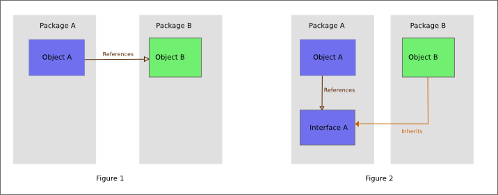

2022060301-4 [依赖倒置原则](2022060301-4.note.md)
=======================================
> *author: xinzhiniepan*
> *time  : 2022-06-04 00:34*
---------------------------------------
依赖倒置原则(dependence inversion principle)是指一种特定的解耦形式(传统的依赖关系创建在高层次上，而具体的策略设置则在应用低层次模块上)，使得高层次的模块不依赖于低层次的模块实现细节，依赖关系被颠倒，从而使得地层次模块依赖于高层次模块的需求抽象。通俗的讲就是面向接口编程，而不是面向实现编程。

> *图1中，高层对象A依赖于底层对象B的实现；
> 图2中，把高层对象A对底层对象的需求抽象为一个接口A，底层对象B实现了接口A，这就是依赖反转。*

DIP原则规定：
1. 高层次模块不应该依赖于地层次的模块，而应该是两者同时依赖于抽象接口。
2. 抽象接口不应该依赖于具体实现，具体实现应该依赖于抽象接口。

---------------------------------------
引用
1. [依赖反转原则-维基百科](https://zh.m.wikipedia.org/wiki/%E4%BE%9D%E8%B5%96%E5%8F%8D%E8%BD%AC%E5%8E%9F%E5%88%99)

---------------------------------------
被引用
1. 2022060301 [设计模式之七大基本原则](2022060301.note.md)

---------------------------------------
[上一条](2022060301-3.note.md)      [下一条](2022060301-5.note.md)
[返回上层](2022060301.note.md)    下层
